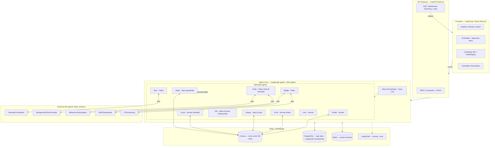
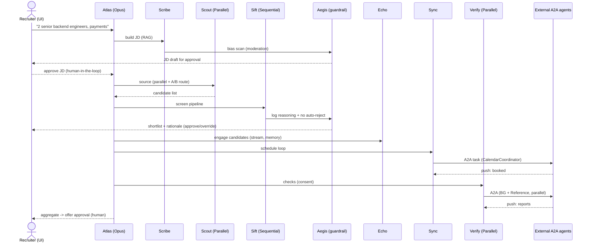

# TalentMesh — A Multi-Agent HR-Tech Platform

### An agentic talent-acquisition system built on LangGraph + Google ADK + the A2A protocol, with RAG, a local vector DB, and the full Claude model family

**Version 1.0 — Design Blueprint**
*Author: Solutions Architecture · Scope: end-to-end recruiting, from job intake to onboarding handoff*

---

## 1. Executive summary

**TalentMesh** is an agentic recruiting platform that compresses the hiring funnel — intake, sourcing, screening, assessment, engagement, scheduling, checks, and onboarding handoff — from weeks into days, while keeping a human recruiter in command of every consequential decision.

It is built as a **team of 11 specialized AI agents** that collaborate. Internally, the agents are orchestrated with **LangGraph** (durable state machine, persistence, streaming, human-in-the-loop, time-travel audit) and **Google ADK** (hierarchical agent teams, Sequential/Parallel/Loop workflow agents, agents-as-tools, agent routing). Externally — for calendars, background checks, references, HRIS, and IT provisioning — the agents speak to third-party vendor agents over the **A2A (Agent2Agent) protocol** (Agent Cards, signed cards, tasks, multi-protocol bindings, push notifications). **RAG** over a local vector database grounds every agent in the company's own job ladders, candidate corpus, policies, and compliance rules. Each agent is powered by the **Claude model best matched to its job** — Opus 4.8 for judgment, Sonnet 4.6 for the balanced workhorse roles, Haiku 4.5 for high-volume speed.

The recruiter experiences all of this through a **TypeScript/React front end** that feels less like an applicant-tracking database and more like a *mission-control* room: a live pipeline, a stream of what the agents are doing, an approvals inbox, and a one-click "replay this decision" audit view that satisfies 2026 AI-hiring regulation.

> The design goal is **demonstration breadth**: nearly every feature of LangGraph, ADK, and A2A discussed earlier maps onto a concrete, defensible place in this product. Section 6 is the full coverage matrix.

---

## 2. Problem statement

Hiring is simultaneously one of the highest-leverage and most administratively punishing things a company does.

- The **average global time-to-hire is ~44 days**, and recruiters spend an estimated **13 hours per week just sourcing** candidates for a *single* open role — before a single interview is scheduled.
- The **average cost per hire is ~$4,700**, and every extra week a role stays open compounds that through lost productivity.
- **52% of candidates** say they will walk away from a slow, disjointed, or impersonal process — so the administrative drag directly costs you the best people.
- Volume roles make it worse: a single support req can draw **200+ applications per week**, and a legacy keyword-matching ATS routinely filters out strong candidates who simply used the "wrong" word.

At the same time, **2026 is the year AI hiring became a regulated activity**, which raises the stakes on *how* you automate:

- The **EU AI Act** classifies recruitment/hiring/promotion AI as **high-risk**, with deployer obligations live from **2 August 2026**, mandatory **human oversight**, an auditable **reasoning log** for every ranking, and penalties up to **€35M or 7% of global turnover**.
- **NYC Local Law 144** requires **annual independent bias audits** (selection rates and impact ratios across sex and race/ethnicity), **public posting**, and **candidate notice at least 10 business days** before an automated tool is used — with liability sitting on the **employer**, not the vendor.
- **Colorado's AI Act**, **Illinois' AI Video Interview Act**, **California's ADS rules**, and **EEOC Title VII disparate-impact** doctrine all add overlapping obligations.

**The core tension:** recruiters need agentic automation to survive the volume and speed expectations, but they cannot deploy a black box that makes opaque, unauditable, potentially biased decisions. They need automation that is **fast, coordinated, grounded in their own data, and provably governed** — with a human making every final call.

TalentMesh is built precisely on that tension. The agents do the heavy lifting (sourcing, parsing, scoring, scheduling, communicating, checking); the recruiter does the judgment; and a dedicated **governance agent plus LangGraph time-travel** make every decision explainable and replayable.

---

## 3. Target personas

### 3.1 Primary — Riya, the Technical Recruiter (the main front-end user)
- **Context:** owns 12–18 open reqs across engineering and design; juggles sourcing, screening, scheduling, and candidate experience simultaneously.
- **Pain:** drowning in resumes, context-switching between LinkedIn / ATS / calendar / email, losing candidates to slow responses, and now being asked to *prove* her process is unbiased.
- **What she wants from TalentMesh:** a single screen that shows every pipeline live, agents that do the busywork, and the ability to approve or override with one click — plus an audit trail she can hand to legal.
- **Success metric:** time-to-shortlist, candidate response rate, and "hours returned to high-value work."

### 3.2 Secondary — Marcus, the Hiring Manager
- **Context:** an engineering lead who opens a req, then mostly wants to *not* think about it until great candidates appear.
- **Interaction:** kicks off intake in plain language ("I need two senior backend engineers for payments"), approves the AI-drafted JD, and reviews a curated shortlist with rationale.
- **Success metric:** quality of shortlist, low time spent, calibrated interviews.

### 3.3 Secondary — Sofia, the Candidate
- **Context:** a strong senior designer with options; impatient with bad process.
- **Interaction:** chats with a candidate assistant 24/7 (benefits, timeline, visa questions), gets fast scheduling, never gets ghosted, and is told clearly that a human reviews every decision.
- **Success metric:** responsiveness, transparency, respect — completion and offer-accept rates.

### 3.4 Oversight — Dana, the HR / DEI Compliance Lead
- **Context:** accountable for the company surviving an EU AI Act conformity assessment and a Local Law 144 bias audit.
- **Interaction:** lives in the **Compliance & Audit** view — reasoning logs, impact-ratio dashboards, and the ability to replay any candidate's journey to see exactly why a decision was made.
- **Success metric:** zero compliance gaps, defensible documentation, demonstrable human oversight.

### 3.5 Builder — Theo, the Platform Engineer
- **Context:** maintains the agent platform itself.
- **Interaction:** uses **LangGraph Studio** to visualize and debug graphs, **LangSmith** to trace and evaluate agent runs, and the ADK evaluation harness to catch regressions before deploy.
- **Success metric:** agent reliability, traceability, safe iteration.

---

## 4. The agent roster (11 agents)

The system is a **hierarchy** (ADK org-chart model): one root coordinator delegates to specialist agents, several of which are themselves **workflow agents** (Sequential / Parallel / Loop) wrapping sub-steps. Each specialist is also exposed to the coordinator **as a tool** (ADK AgentTools), so the coordinator can reason about a request and call the right specialist.

| # | Agent | Codename | Claude model | Primary job | ADK type |
|---|-------|----------|--------------|-------------|----------|
| 1 | **Orchestrator** | *Atlas* | **Opus 4.8** | Root coordinator; plans, routes, delegates, handles fallback/A-B routing | LLM agent (root) |
| 2 | **Intake & JD Builder** | *Scribe* | **Sonnet 4.6** | Turns a manager's request into a structured, inclusive, leveled JD | LLM agent + artifacts |
| 3 | **Sourcing** | *Scout* | **Sonnet 4.6** | Finds candidates across channels via semantic search | Parallel workflow agent |
| 4 | **Screening** | *Sift* | **Haiku 4.5** (parse) + **Sonnet 4.6** (score) | Parses resumes, extracts skills, scores & ranks vs the JD | Sequential workflow agent |
| 5 | **Assessment** | *Gauge* | **Opus 4.8** | Generates/evaluates skills assessments against rubrics | Loop workflow agent |
| 6 | **Engagement** | *Echo* | **Sonnet 4.6** (chat) + **Haiku 4.5** (notifications) | Candidate Q&A, outreach, nurture, anti-ghosting | LLM agent + Loop (nurture) |
| 7 | **Interview Coordination** | *Sync* | **Haiku 4.5** | Schedules multi-party interviews | LLM agent (A2A client) |
| 8 | **Compliance & Governance** | *Aegis* | **Opus 4.8** | Bias/EEOC/EU-AI-Act guardrails, reasoning logs, the "human-decision boundary" | Custom + LLM agent |
| 9 | **Background & Reference** | *Verify* | **Haiku 4.5** (orchestrate) + **Sonnet 4.6** (summarize) | Runs background + reference checks | Parallel workflow agent (A2A client) |
| 10 | **Analytics & Insights** | *Lens* | **Sonnet 4.6** | Funnel metrics, source effectiveness, bias-audit math (impact ratios) | LLM agent + custom tools |
| 11 | **Onboarding Handoff** | *Bridge* | **Haiku 4.5** | Hands the hired candidate off to HRIS + IT provisioning | LLM agent (A2A client) |

### 4.1 Agent detail

**1 · Atlas — Orchestrator (Opus 4.8).** The "CEO." Receives every recruiter/manager request and the current `RecruitingState`, decides which specialist(s) to invoke, in what order, and merges their results. Uses **ADK agent routing** for (a) *fallback* — if the primary sourcing strategy returns too few candidates, route to a backup strategy; and (b) *A/B testing* — split a req's sourcing between two strategies and compare yield. Opus is justified by the open-ended planning and multi-constraint reasoning.

**2 · Scribe — Intake & JD Builder (Sonnet 4.6).** Converts "I need two senior backend engineers for payments" into a complete JD. **RAG** over `job_knowledge` (leveling guide, comp bands, past JDs, inclusive-language rules). Emits the JD as an **ADK artifact** (a persistent document). Every draft is checked by **Aegis** for biased/exclusionary language before it reaches the recruiter for **human-in-the-loop approval**.

**3 · Scout — Sourcing (Sonnet 4.6).** An **ADK ParallelAgent**: fans out to multiple sourcing channels *simultaneously* — internal `candidate_corpus` (semantic vector search), LinkedIn (via **MCP** connector), and referrals — then gathers and de-duplicates. For clearance-gated reqs it applies a **metadata filter** on the vector search (e.g., `clearance = Secret`). Two sourcing strategies can run as an **A/B route** orchestrated by Atlas.

**4 · Sift — Screening (Haiku 4.5 → Sonnet 4.6).** An **ADK SequentialAgent** pipeline: `parse_resume → extract_structured_skills → score_against_jd → rank`. The high-volume parse/extract steps run on **Haiku 4.5** (cheap, fast, thousands of resumes); the judgment-heavy scoring step runs on **Sonnet 4.6**. Output is a ranked list with per-candidate sub-scores. A **LangGraph conditional edge** then branches on `screen_score` vs the req's `screening_threshold`: advance, reject, or — for borderline scores — route to a human.

**5 · Gauge — Assessment (Opus 4.8).** An **ADK LoopAgent**: generate/score an assessment, check it against the `interview_rubrics`, and *iterate* until the rubric is satisfied or max iterations hit. Supports **ADK bidirectional streaming** for live coding or voice/video assessments. Opus handles the high-stakes evaluative judgment.

**6 · Echo — Engagement (Sonnet 4.6 + Haiku 4.5).** The candidate-facing conversational agent. **RAG** over `company_knowledge` (benefits, culture, FAQ, visa) answers candidate questions 24/7 with **LangGraph streaming**. Maintains **long-term memory** per candidate (the `interaction_history`) so every touch is contextual. A **LoopAgent** nurture flow re-engages quiet candidates until they respond or a cap is reached (the anti-ghosting loop). Quick transactional notes (confirmations, reminders) run on **Haiku 4.5**; richer conversations on **Sonnet 4.6**. Can trigger **A2A UX negotiation** to escalate a text chat into a video call.

**7 · Sync — Interview Coordination (Haiku 4.5).** An **A2A client** to the external `CalendarCoordinator` agent. Finds mutual slots across the candidate and N interviewers, books, sends invites, and reschedules — all as an **A2A task** with a lifecycle, receiving **push notifications** on completion. Pure logistics → Haiku.

**8 · Aegis — Compliance & Governance (Opus 4.8).** The guardrail and the conscience. Implemented partly as **ADK custom (deterministic) agents** (e.g., the PII-segmentation gate, impact-ratio math) and partly as an **LLM agent** (Opus) for nuanced language/bias review. It (a) scans JDs and messages for bias before they go out, (b) enforces the **human-decision boundary** — no agent may auto-reject or auto-hire, (c) writes the **reasoning log** the EU AI Act requires, and (d) enforces PII segmentation so demographic data never reaches scoring agents. In LangGraph terms, Aegis is the **moderation/quality-control** layer wrapping consequential edges.

**9 · Verify — Background & Reference (Haiku 4.5 + Sonnet 4.6).** An **ADK ParallelAgent** that, with candidate consent, runs the **A2A** `BackgroundCheckProvider` and `ReferenceCheckAgent` *concurrently*. Demonstrates **A2A signed Agent Cards** (verify the vendor is genuine), **multi-protocol bindings**, **version negotiation** (the reference vendor only speaks v0.3), and **long-running tasks with push notifications**. Sonnet summarizes the returned report artifacts.

**10 · Lens — Analytics & Insights (Sonnet 4.6).** Produces pipeline dashboards and reports as **ADK artifacts**, using **custom tools** (SQL/metrics) over the application database. Critically, it computes the **selection rates and impact ratios** that feed the Local Law 144 bias audit, working hand-in-hand with Aegis.

**11 · Bridge — Onboarding Handoff (Haiku 4.5).** Once an offer is accepted, Bridge fires the classic **A2A cross-vendor handoff**: it calls the `HRISOnboarding` agent to create the employee record and the `ITProvisioning` agent to order a laptop and access by role — in parallel, with push notifications back to the recruiter. Orchestration only → Haiku.


---

## 5. Feature coverage matrix

This is the proof that the design exercises *nearly all* the features discussed. Three tables — LangGraph, Google ADK, A2A.

### 5.1 LangGraph

| Feature | Where it is used in TalentMesh |
|---|---|
| **Graph structure (nodes / edges / state)** | The whole recruiting funnel is one LangGraph graph; each agent is a node, routing logic is edges |
| **Central state management** | A shared `RecruitingState` (req, candidate, scores, stage, reasoning log) flows through every node |
| **Durable execution** | A req stays open for weeks; the Postgres checkpointer lets a paused run resume after a crash exactly where it left off |
| **Looping & branching (conditional edges)** | Screening branches on score-vs-threshold (advance / reject / human); assessment & nurture loops |
| **Streaming** | Token-by-token candidate chat (Echo) and the recruiter "mission-control" activity feed |
| **Persistence (checkpointers)** | Postgres checkpointer per req/candidate thread |
| **Short-term + long-term memory** | Thread-scoped memory for a live conversation; a Store holds each candidate's cross-session history |
| **Time travel / replay** | The Compliance & Audit view replays any candidate's decision path — the core EU AI Act explainability feature |
| **Human-in-the-loop** | JD approval, shortlist approval, borderline-candidate review, and offer approval all `interrupt()` for a human |
| **Moderation / quality controls** | Aegis wraps every consequential edge; nothing is sent or decided without passing its checks |
| **Multiple control flows (hierarchical)** | Atlas → specialists → sub-steps; single, multi-agent, and hierarchical flows coexist |
| **Low-level primitives** | Custom deterministic nodes (PII gate, scoring math) sit beside LLM nodes |
| **LangGraph Studio** | Theo (platform eng) visualizes & debugs the graph during development |
| **LangGraph Platform** | Production deployment target for the long-running, stateful graph |
| **LangSmith integration** | Tracing, evaluation of agent trajectories, and production observability |

### 5.2 Google ADK

| Feature | Where it is used in TalentMesh |
|---|---|
| **Three agent types (LLM / Workflow / Custom)** | LLM agents (Atlas, Scribe, Echo…); Workflow agents (Sift, Scout, Gauge, Verify); Custom deterministic agents (Aegis gates, Lens metrics) |
| **Hierarchical orchestration (parent/sub, single-parent rule)** | Atlas is the root; specialists are sub-agents in a clean org-chart |
| **SequentialAgent** | Sift's pipeline: parse → extract → score → rank |
| **ParallelAgent** | Scout (source channels at once); Verify (background + reference concurrently); Bridge (HRIS + IT at once) |
| **LoopAgent** | Gauge (iterate assessment until rubric satisfied); Echo (re-engage until response/cap) |
| **Agents-as-tools (AgentTools)** | Every specialist is exposed to Atlas as a callable tool |
| **Graph-based workflows (ADK 2.0)** | Deterministic nodes interwoven with AI agents on an explicit execution graph |
| **Dynamic / collaborative / template workflows** | Template workflows (Sequential/Parallel/Loop) + Atlas as a dynamic coordinator |
| **Agent Routing (fallback / A-B / auto)** | Atlas: fallback sourcing strategy + A/B test of two sourcing strategies |
| **Tools & integrations (MCP, connectors)** | LinkedIn, ATS, calendar, HRIS connectors via MCP tools |
| **Custom tools** | Scoring functions, SQL/metrics, impact-ratio calculators |
| **Artifacts** | JDs (Scribe), offer letters, analytics reports (Lens), check reports |
| **Skills / Plugins** | Reusable "score-against-rubric," "inclusive-language-scan" skills |
| **Context management** | ADK filters/summarizes long candidate histories to stay within context limits |
| **Bidirectional streaming** | Live coding / voice / video assessment (Gauge) and video interviews |
| **Built-in evaluation** | ADK eval harness checks agent decision quality before deploy |
| **Deployment (Agent Engine / Cloud Run / GKE)** | Containerized agents on managed infra |

### 5.3 A2A (Agent2Agent) protocol

| Feature | Where it is used in TalentMesh |
|---|---|
| **Cross-vendor interoperability** | TalentMesh agents talk to 5 external vendor agents (calendar, bg-check, reference, HRIS, IT) built on different stacks |
| **Agent Cards (capability discovery)** | Each external integration publishes a card (see `external_agent_cards.json`) |
| **Tasks (lifecycle: submitted → working → completed/failed)** | Scheduling, background check, onboarding are all A2A tasks |
| **Messages with parts (content negotiation)** | Text/file/structured payloads negotiated between agents (e.g., consent token, report PDF) |
| **Artifacts** | Returned check reports, calendar invites, employee-record confirmations |
| **HTTP / JSON-RPC / SSE transport** | Standard web transport for all external calls |
| **Signed Agent Cards** | Verify, Sync, Bridge verify each vendor card's cryptographic signature before trusting it |
| **Multi-tenancy** | TalentMesh is SaaS — one deployment serves many client companies; each tenant's agents isolated |
| **Multi-protocol bindings (JSON-RPC + gRPC)** | CalendarCoordinator & HRIS expose both; high-volume calls use gRPC |
| **Version negotiation** | ReferenceCheckAgent only speaks v0.3; client negotiates down from 1.0 with a compatibility shim |
| **Security / auth schemes in cards** | OAuth2 scopes / API keys declared per card |
| **UX negotiation** | Echo escalates a text screening chat into a video call mid-conversation |
| **Push notifications + streaming** | Long-running background checks push completion events back; recruiter gets a toast |
| **SDKs (Python)** | The Python backend uses the A2A Python SDK as the client |


---

## 6. System architecture

Three planes: a **TypeScript front end**, a **Python agent backend**, and an **external A2A ecosystem**. RAG and state stores sit underneath the backend.



**How the planes interact**

1. The recruiter acts in the **React** UI → a **REST** call hits **FastAPI**.
2. FastAPI invokes the **LangGraph** graph; **Atlas** plans and delegates to **ADK** specialist agents.
3. Agents read/write the shared **state** (Postgres checkpointer makes it durable), pull grounding from **Chroma** (RAG), and emit **streaming** tokens/events to **Redis**.
4. Specialist agents needing the outside world open **A2A** tasks to vendor agents.
5. FastAPI relays streamed events and push notifications back to the browser over **SSE / WebSocket**, so the pipeline updates live.
6. Every run is traced to **LangSmith**; every consequential decision is wrapped by **Aegis** and logged for audit.


---

## 7. RAG design

**Vector DB choice: Chroma (local, embedded).** It runs in-process with zero infrastructure, persists to disk, and supports metadata filtering — ideal for a local/dev demo. *Production swap-ups:* Qdrant or pgvector (so the vector store lives next to the Postgres app data) or Weaviate. The retrieval interface is abstracted behind a `Retriever` port so the store is replaceable.

**Embeddings.** Default to **Voyage AI** (`voyage-3`), Anthropic's recommended embedding partner, for quality. For a *fully local* setup, swap in a sentence-transformers model (`BAAI/bge-large-en-v1.5`). Claude itself does generation, not embeddings, so the embedding model is a separate component.

**Five collections**, each owned by specific agents:

| Collection | Source data (synthetic) | Owner agent(s) | Used for |
|---|---|---|---|
| `job_knowledge` | `leveling_comp.json` (ladders, comp bands, JD templates) + past JDs | Scribe, Sift | Draft leveled, inclusive JDs; derive scoring criteria |
| `candidate_corpus` | `candidates.json` (resume_text + skills, with metadata) | Scout | Semantic sourcing & matching, with metadata filters (clearance, location, level) |
| `company_knowledge` | `company_knowledge.json` (benefits, culture, FAQ, visa) | Echo | Answer candidate questions 24/7 |
| `compliance_kb` | `compliance_rules.json` (EU AI Act, LL144, EEOC, internal) | Aegis | Ground bias/compliance checks in actual rules |
| `interview_kb` | `interview_rubrics.json` (rubrics, scorecards) | Gauge | Generate & score assessments against the right rubric |

**Chunking & metadata.** Resumes and KB docs are chunked (~300–500 tokens, semantic boundaries) and stored with metadata (`req_id`, `level`, `location`, `clearance`, `category`, `doc_id`). Retrieval always applies metadata filters first (e.g., a Secret-clearance req filters `candidate_corpus` to `clearance = Secret` *before* semantic ranking), then runs vector similarity, then passes the top-k chunks to the agent as grounded context with citations.

**Why RAG and not fine-tuning.** Job ladders, comp bands, policies, and compliance rules change constantly and must be *auditable to a source*. RAG keeps answers current, attributable, and editable without retraining — which also matters for the EU AI Act's explainability requirement.

---

## 8. End-to-end workflow

A single req — **REQ-2026-0431, Senior Backend Engineer** — walked through the system. Note where each feature fires (**bold**) and where a **human approves**.

1. **Intake.** Marcus types "I need two senior backend engineers for payments." Atlas (**hierarchical routing**) calls **Scribe**, which **RAG**-pulls the L5 ladder + `BAND-ENG-L5` and drafts a JD as an **artifact**. **Aegis** scans it for biased language (**moderation**). → **Riya approves the JD (human-in-the-loop).**
2. **Sourcing.** Atlas invokes **Scout** (**ParallelAgent**): internal `candidate_corpus` semantic search + LinkedIn (**MCP**) + referrals, concurrently. Atlas also runs an **A/B route** of two sourcing strategies. Candidates Priya, Amara, Marcus W. surface.
3. **Screening.** **Sift** (**SequentialAgent**) runs `parse (Haiku) → extract (Haiku) → score (Sonnet) → rank`. A **LangGraph conditional edge** branches on `screen_score` vs `0.72`: Amara (0.91) and Priya (0.86) advance; Marcus W. (0.58) → reject path; a 0.63 borderline → **human review**. **Aegis** ensures no candidate is *auto-rejected* — the recruiter confirms (**human-decision boundary**) — and writes a **reasoning log** entry per candidate.
4. **Engagement.** **Echo** sends personalized outreach (**Sonnet**) and confirmations (**Haiku**), answers benefits/visa questions via **company_knowledge RAG** with **streaming**, and uses **long-term memory** to stay contextual. Quiet candidates enter the **LoopAgent nurture** flow.
5. **Assessment.** **Gauge** (**LoopAgent**, **Opus**) issues a system-design assessment, scores it against `RUB-ENG-SYSDESIGN`, iterating until the rubric is satisfied; optionally a **bidirectional-streaming** live coding session.
6. **Scheduling.** **Sync** opens an **A2A task** to `CalendarCoordinator` to coordinate a 5-interviewer onsite for Amara; receives a **push notification** when booked.
7. **Checks.** With consent, **Verify** (**ParallelAgent**) runs `BackgroundCheckProvider` and `ReferenceCheckAgent` **concurrently over A2A** — demonstrating **signed cards**, **version negotiation** (reference vendor v0.3), and **long-running tasks with push**.
8. **Decision & offer.** Scores, assessment, and checks aggregate in **state**. → **Riya/Marcus approve the offer (human-in-the-loop).** Aegis finalizes the reasoning log.
9. **Onboarding handoff.** On accept, **Bridge** fires an **A2A** handoff: `HRISOnboarding` (create employee) + `ITProvisioning` (laptop/access by role), in **parallel**, pushing status back.
10. **Throughout — governance.** **Lens** computes funnel metrics and **impact ratios** for the **Local Law 144** audit; **Aegis** keeps the reasoning log; the recruiter (or Dana) can **time-travel/replay** any candidate's path.




---

## 9. Inter-agent communication (A2A) in detail

**Internal vs external.** Inside TalentMesh, agents communicate through **shared LangGraph state + ADK delegation** (fast, in-process). When an agent must cross a trust/vendor boundary, it switches to **A2A** — the open protocol that lets agents from different vendors discover and collaborate as peers.

**Discovery → trust → task.** A client agent (e.g., Sync) fetches the vendor's **Agent Card** from a well-known URL, **verifies its cryptographic signature** (the card is signed by `calendar-vendor.example.com`, defeating card-forgery), authenticates per the card's declared scheme (OAuth2 scopes), then opens a **task**.

**Task lifecycle.** `submitted → working → (input-required) → completed | failed | canceled`. Long-running checks stay in `working` and **push** a notification on completion rather than blocking.

**Example — Sync books an interview (A2A task message, JSON-RPC):**

```json
{
  "jsonrpc": "2.0",
  "id": "task-7741",
  "method": "tasks/send",
  "params": {
    "skill": "find_mutual_slots",
    "message": {
      "role": "user",
      "parts": [
        { "type": "data", "data": {
            "candidate_id": "CAND-90105",
            "attendees": ["int-01","int-02","int-03","int-04","int-05"],
            "duration_min": 60,
            "window": { "start": "2026-06-22", "end": "2026-06-26" },
            "timezone": "America/Chicago"
        }}
      ]
    },
    "pushNotification": { "url": "https://talentmesh.app/a2a/callbacks/task-7741" }
  }
}
```

The vendor replies with an **artifact** (proposed slots), Sync confirms `book_interview`, and the vendor **pushes** the booked-event artifact to the callback URL. **UX negotiation** appears when Echo upgrades a text chat: it sends a message part advertising `video` capability; if the candidate's client supports it, the modality switches mid-task.

**Multi-protocol & versioning.** CalendarCoordinator and HRIS expose **both JSON-RPC and gRPC** (TalentMesh uses gRPC for high-volume scheduling). ReferenceCheckAgent only speaks **v0.3**, so the client performs **version negotiation** down from 1.0 with a compatibility shim — exactly the backward-compat guarantee A2A v1.0 provides.

---

## 10. LLM model-assignment strategy (the full Claude family)

Matching the model to the cognitive load of each agent controls cost and latency without sacrificing quality where it matters. All three current Claude tiers are used.

| Model | API string | Assigned to | Why |
|---|---|---|---|
| **Claude Opus 4.8** | `claude-opus-4-8` | Atlas, Gauge, Aegis | Open-ended planning, high-stakes evaluative judgment, and compliance reasoning where errors are most costly |
| **Claude Sonnet 4.6** | `claude-sonnet-4-6` | Scribe, Scout, Sift (scoring), Echo (chat), Verify (summarize), Lens | The balanced workhorse — strong reasoning at much lower cost for the bulk of the funnel |
| **Claude Haiku 4.5** | `claude-haiku-4-5-20251001` | Sift (parse/extract), Echo (notifications), Sync, Verify (orchestrate), Bridge | High-volume, latency-sensitive, lower-complexity tasks (parse thousands of resumes, send confirmations, coordinate logistics) |

**Tiered-within-an-agent pattern.** Sift and Echo deliberately mix tiers: Sift parses on **Haiku** (cheap at volume) but scores on **Sonnet** (judgment); Echo sends reminders on **Haiku** but converses on **Sonnet**. This is the single biggest cost lever — you pay Opus/Sonnet prices only on the tokens that need them.

> *Note on a higher tier:* Anthropic's Mythos tier exists above Opus but is not publicly available, so the design standardizes on Opus 4.8 as the top reasoning model. The model layer is abstracted behind a `model_for(role)` resolver, so tiers can be re-pointed centrally (and A/B-tested via **LangSmith eval**) without touching agent code.


---

## 11. Tech stack

### Frontend (TypeScript)
- **Framework:** Next.js (React, App Router) in **TypeScript**.
- **UI:** Tailwind CSS + shadcn/ui (accessible component primitives); a kanban lib (e.g. dnd-kit) for the pipeline board.
- **Server state & caching:** TanStack Query; **client state:** Zustand.
- **Real-time:** native **EventSource (SSE)** for agent token/event streams; a WebSocket channel for bidirectional candidate chat.
- **Auth:** OAuth2/OIDC (Auth.js); role-based views (Recruiter / Hiring Manager / Compliance / Admin).
- **Validation:** Zod schemas shared with API contracts (OpenAPI-generated types).

### Backend (Python)
- **API gateway:** **FastAPI** (async) — REST for commands/CRUD, SSE + WebSocket for streaming.
- **Orchestration:** **LangGraph** (the durable state-machine graph, checkpointer, interrupts for HITL, streaming, time-travel).
- **Agents:** **Google ADK** (LlmAgent, SequentialAgent, ParallelAgent, LoopAgent, custom agents, AgentTools).
- **Inter-agent (external):** **A2A Python SDK** (client + a server facade so TalentMesh agents can also be *called* via A2A by partners).
- **Tool integrations:** **MCP** clients for LinkedIn / ATS / calendar connectors.
- **LLMs:** Anthropic API — Claude **Opus 4.8 / Sonnet 4.6 / Haiku 4.5**.
- **RAG:** **Chroma** (local vector DB) + **Voyage** embeddings (or local `bge-large` for fully-local).

### Data & infra
- **PostgreSQL** — application data **and** the LangGraph checkpointer (durable execution/persistence).
- **Redis** — streaming pub/sub + short-term cache.
- **LangSmith** — tracing, evaluation, prod observability.
- **Deployment** — containers on **Cloud Run / GKE** or **LangGraph Platform** / **Vertex AI Agent Engine**; **LangGraph Studio** for local debugging.
- **Object storage** — S3/GCS for artifacts (JDs, reports, offer letters).

### Contract between TS and Python
The Python backend publishes an **OpenAPI** schema; the TS app generates types from it, so the front end and back end share one source of truth. Streaming payloads use a small set of typed SSE events (`agent.thinking`, `agent.token`, `stage.changed`, `approval.required`, `task.completed`).

---

## 12. How the recruiter uses it (the front end)

The product deliberately *does not* look like a spreadsheet-style ATS. It is a **mission-control** surface where agents are visibly working and the recruiter steers. Riya's day runs through six screens.

### 12.1 Pipeline / Mission Control (home)
A **kanban board**: columns are funnel stages (Sourced → Screened → Assessment → Interview → Checks → Offer), cards are candidates. The board **updates live** as agents move candidates — driven by `stage.changed` SSE events. A right-hand **Agent Activity Feed** streams what each agent is doing in plain language ("Sift scored 38 resumes for REQ-0431", "Sync booked Amara's onsite") — this is **LangGraph streaming** surfaced as a feed. A badge shows pending approvals.

### 12.2 Intake & JD Builder
A conversational panel: the manager/recruiter describes the role; **Scribe** drafts a JD in a side-by-side editor. The recruiter edits inline and clicks **Approve & Open Req** — this resolves a **LangGraph `interrupt()`** (human-in-the-loop). An inline banner shows **Aegis**'s inclusive-language check result before approval.

### 12.3 Approvals Inbox
Every human-decision point in one queue: *JD approvals, shortlist approvals, borderline-candidate reviews, offer approvals.* Each item shows the agents' recommendation **plus the rationale and the reasoning-log excerpt**, with **Approve / Override / Request changes**. This is where the "AI assists, human decides" boundary is operationalized — and it directly satisfies the EU AI Act human-oversight requirement.

### 12.4 Candidate 360
One candidate, everything: parsed resume, sub-scores with explanations, assessment results, full **interaction history** (long-term memory), scheduling status, check status, and compliance flags. The recruiter can message the candidate (handed to **Echo**) or nudge a stage.

### 12.5 Compliance & Audit (Dana's home)
- **Reasoning-log viewer** — for any candidate, the chain of why each decision was made.
- **Replay** — a "time-travel" control that re-runs the graph to any prior checkpoint to show the exact state behind a decision (**LangGraph time travel**).
- **Bias-audit dashboard** — selection rates and **impact ratios** across protected groups (from **Lens**), exportable for the Local Law 144 annual audit.

### 12.6 Analytics
Funnel conversion, time-to-stage, source effectiveness (which channel/strategy yields hires — feeding back into Atlas's A/B routing), and recruiter-hours-saved. Rendered from **Lens** artifacts.

### 12.7 The candidate-facing surface (separate app)
A public chat widget where candidates talk to **Echo** 24/7 (benefits, timeline, visa, "where am I in the process?"). Streamed responses, channel-aware (web/SMS/email), with the legally required notice that AI assists but a human decides — and a one-click "request an alternative process" per Local Law 144.

### 12.8 Front-end ↔ back-end interaction (concretely)
- **Command (recruiter approves shortlist):** React → `POST /reqs/{id}/shortlist/approve` → FastAPI resumes the paused LangGraph thread → agents proceed → UI updates via SSE.
- **Streaming (candidate chat):** WebSocket ↔ FastAPI ↔ Echo's `astream()` → tokens render live.
- **Long-running (background check done):** vendor **A2A push** → FastAPI → Redis → SSE `task.completed` → toast + Candidate-360 status flips.
- **Live pipeline:** LangGraph state changes publish `stage.changed` → SSE → kanban card moves without a refresh.


---

## 13. Representative code skeletons (Python backend)

These are illustrative, not a full implementation — enough to show exactly where each feature lives.

### 13.1 Shared LangGraph state + conditional branching + human-in-the-loop

```python
from typing import TypedDict, Annotated, Literal
from operator import add
from langgraph.graph import StateGraph, START, END
from langgraph.checkpoint.postgres import PostgresSaver
from langgraph.types import interrupt

class RecruitingState(TypedDict):
    req_id: str
    candidate_id: str
    stage: str
    screen_score: float | None
    assessment_score: float | None
    reasoning_log: Annotated[list[dict], add]   # append-only -> audit trail
    messages: Annotated[list, add]

def screen_node(state: RecruitingState) -> dict:
    # Sift (ADK SequentialAgent) runs parse->extract->score->rank
    score = run_sift_pipeline(state["req_id"], state["candidate_id"])
    entry = {"step": "screen", "score": score, "model": "haiku+sonnet"}
    return {"screen_score": score, "reasoning_log": [entry]}

def route_after_screen(state: RecruitingState) -> Literal["advance", "human_review", "reject"]:
    threshold = get_threshold(state["req_id"])     # e.g. 0.72
    s = state["screen_score"]
    if s >= threshold:            return "advance"
    if s >= threshold - 0.10:     return "human_review"   # borderline
    return "reject"

def human_review_node(state: RecruitingState) -> dict:
    # Aegis guarantees no auto-reject: pause for a human (EU AI Act oversight)
    decision = interrupt({"candidate_id": state["candidate_id"],
                          "score": state["screen_score"],
                          "recommendation": "borderline - your call"})
    return {"reasoning_log": [{"step": "human_review", "decision": decision}]}

g = StateGraph(RecruitingState)
g.add_node("screen", screen_node)
g.add_node("human_review", human_review_node)
g.add_node("advance", advance_node)
g.add_node("reject", reject_node)
g.add_edge(START, "screen")
g.add_conditional_edges("screen", route_after_screen,
                        {"advance": "advance", "human_review": "human_review", "reject": "reject"})
g.add_edge("human_review", "advance")   # after human says yes

# Durable execution + persistence: a req can pause for weeks and resume after a crash
checkpointer = PostgresSaver.from_conn_string(POSTGRES_URL)
graph = g.compile(checkpointer=checkpointer)

# Streaming to the recruiter mission-control feed
for event in graph.stream(initial_state, config={"configurable": {"thread_id": "REQ-0431:CAND-90105"}}):
    publish_to_redis(event)   # -> SSE -> React
```

### 13.2 ADK workflow agents (Sequential / Parallel / Loop) + agents-as-tools

```python
from google.adk.agents import LlmAgent, SequentialAgent, ParallelAgent, LoopAgent
from google.adk.tools import AgentTool

# Sift: a Sequential pipeline (Haiku for volume, Sonnet for judgment)
parse   = LlmAgent(name="parse",   model="claude-haiku-4-5-20251001", instruction=PARSE_PROMPT)
extract = LlmAgent(name="extract", model="claude-haiku-4-5-20251001", instruction=EXTRACT_PROMPT)
score   = LlmAgent(name="score",   model="claude-sonnet-4-6",         instruction=SCORE_PROMPT)
sift = SequentialAgent(name="Sift", sub_agents=[parse, extract, score])

# Scout: source channels in PARALLEL
internal = LlmAgent(name="internal_src", model="claude-sonnet-4-6", tools=[vector_search_tool])
linkedin = LlmAgent(name="linkedin_src", model="claude-sonnet-4-6", tools=[linkedin_mcp_tool])
referral = LlmAgent(name="referral_src", model="claude-sonnet-4-6", tools=[referral_tool])
scout = ParallelAgent(name="Scout", sub_agents=[internal, linkedin, referral])

# Gauge: LOOP until the rubric is satisfied
gauge = LoopAgent(name="Gauge", max_iterations=3,
                  sub_agents=[LlmAgent(name="assess", model="claude-opus-4-8",
                                       instruction=ASSESS_AGAINST_RUBRIC_PROMPT)])

# Atlas: root orchestrator; specialists exposed AS TOOLS, with agent routing
atlas = LlmAgent(
    name="Atlas", model="claude-opus-4-8", instruction=ORCHESTRATOR_PROMPT,
    tools=[AgentTool(agent=sift), AgentTool(agent=scout), AgentTool(agent=gauge),
           AgentTool(agent=scribe), AgentTool(agent=echo), AgentTool(agent=verify)],
)
```

### 13.3 A2A client — verify signed card, open task, await push

```python
from a2a.client import A2AClient

async def schedule_interview(candidate_id: str, attendees: list[str]) -> dict:
    card = await A2AClient.fetch_agent_card("https://calendar-vendor.example.com/a2a")
    assert card.verify_signature(expected_domain="calendar-vendor.example.com")  # signed cards
    client = A2AClient(card, auth=oauth2_token("calendar.write"))

    task = await client.send_task(
        skill="find_mutual_slots",
        data={"candidate_id": candidate_id, "attendees": attendees, "duration_min": 60},
        push_url="https://talentmesh.app/a2a/callbacks",      # push notifications
        protocol="grpc" if card.supports("grpc") else "json-rpc",   # multi-protocol binding
    )
    return task.id   # completion arrives via push -> SSE -> recruiter toast
```

### 13.4 RAG retrieval with metadata filter (Chroma)

```python
import chromadb
from voyageai import Client as Voyage   # or sentence-transformers for fully-local

vdb = chromadb.PersistentClient(path="./chroma")
voyage = Voyage()

def retrieve(collection: str, query: str, where: dict | None = None, k: int = 5):
    col = vdb.get_collection(collection)
    qvec = voyage.embed([query], model="voyage-3").embeddings[0]
    # metadata filter FIRST (e.g. clearance), then semantic similarity
    return col.query(query_embeddings=[qvec], n_results=k, where=where)

# Clearance-gated sourcing for the Staff Security Engineer req
hits = retrieve("candidate_corpus",
                query="application security threat modeling FedRAMP python",
                where={"clearance": "Secret"})
```


---

## 14. Synthetic data (hardcoded JSON)

All demo data ships as JSON in `synthetic_data/` and seeds both the relational store and the Chroma collections.

| File | Records | Feeds |
|---|---|---|
| `jobs.json` | 4 open reqs (eng L5/L6, design L5, CX L2) — incl. a clearance-gated and a high-volume role | App DB; `job_knowledge` |
| `candidates.json` | 8 candidates with `resume_text`, scores, stages, `interaction_history` (above/at/below threshold for branching) | App DB; `candidate_corpus`; long-term memory |
| `company_knowledge.json` | 10 KB docs (benefits, culture, FAQ, visa, AI-notice) | `company_knowledge` (Echo RAG) |
| `leveling_comp.json` | Leveling ladder + comp bands + JD template/inclusive-language rules | `job_knowledge` (Scribe RAG) |
| `compliance_rules.json` | 8 rules (EU AI Act, LL144, IL VIA, EEOC, internal PII/bias) | `compliance_kb` (Aegis RAG) |
| `interview_rubrics.json` | 3 weighted rubrics (system design, CX situational, values) | `interview_kb` (Gauge RAG) |
| `external_agent_cards.json` | 5 A2A vendor cards (calendar, bg-check, reference, HRIS, IT) — signed, with bindings & versions | A2A client registry |

The data is intentionally shaped to exercise the system: e.g., **Amara (0.91)** auto-advances, **Marcus W. (0.58)** hits the reject branch, **Wei (0.63)** is **borderline → human review**, and **Helena** is **clearance-gated** and runs the **A2A background-check** path.

---

## 15. Build roadmap

| Phase | Scope | Demonstrates |
|---|---|---|
| **P0 — Skeleton** | FastAPI + a 3-node LangGraph + Chroma seed + Sonnet only | Graph, state, RAG, streaming |
| **P1 — Core funnel** | Scribe, Scout (Parallel), Sift (Sequential), Echo; HITL approvals; Postgres checkpointer | ADK workflow agents, durable execution, human-in-the-loop, model tiering |
| **P2 — Judgment + governance** | Gauge (Loop, Opus), Aegis (guardrails + reasoning log), time-travel audit | Loop agents, moderation, time travel, EU AI Act oversight |
| **P3 — External world (A2A)** | Sync, Verify, Bridge against mock A2A vendor agents | A2A cards/tasks/signing/push/versioning |
| **P4 — Insight + scale** | Lens (impact ratios), Atlas A/B routing, LangSmith eval, deploy to LangGraph Platform/Cloud Run | Agent routing, analytics, evaluation, deployment, multi-tenancy |

---

## 16. What else can be added (extensions)

- **Internal mobility / talent marketplace.** Reuse `candidate_corpus` over *employees* to match internal candidates to open reqs and build learning plans — a high-ROI agentic HR use case.
- **Voice screening agent.** A fully bidirectional-streaming voice interviewer (ADK live) for Tier-1 volume roles, with Illinois-VIA consent built in.
- **Offer-modeling agent.** Generates competitive offers within comp-band guardrails and models accept-probability.
- **Sentiment / candidate-experience monitor.** Watches engagement signals to flag at-risk (likely-to-ghost) candidates for proactive outreach.
- **"Recruiter copilot" command bar.** Natural-language commands ("show me everyone stuck >5 days in screening") routed through Atlas.
- **Skills-gap & workforce-planning agent.** Aggregates pipeline + headcount to forecast hiring needs.
- **Inbound TalentMesh-as-an-A2A-server.** Expose TalentMesh agents *to partners* via A2A (it's already a server facade) so an external sourcing marketplace can push candidates in.
- **Multi-language + localization** for global candidate pools.
- **Fairness "what-if" simulator.** Let Dana adjust a threshold and instantly see the impact-ratio effect before changing policy.

---

## 17. Compliance & governance backbone (why this design is deployable in 2026)

Governance is not a feature bolted on; it is woven through the graph.

- **Human decides, always.** Aegis enforces that *no agent auto-rejects or auto-hires*. Every advancement and rejection passes through the **Approvals Inbox** (`interrupt()`), satisfying the **EU AI Act** human-oversight mandate.
- **Reasoning log for every ranking.** The append-only `reasoning_log` in state is the EU AI Act explainability artifact; the **Replay/time-travel** view reconstructs any decision.
- **Bias auditing built in.** Lens computes **selection rates and impact ratios** across protected groups for the **NYC Local Law 144** annual audit; the what-if simulator supports remediation.
- **Candidate notice & alternative process.** Echo surfaces the required **10-business-day notice** and the **request-an-alternative** option (LL144); video assessments capture **Illinois-VIA** consent.
- **PII segmentation by architecture.** Aegis's deterministic gate ensures demographic data used for auditing **never reaches scoring/ranking agents** — bias-audit data and decision data are separated at the architecture level.
- **Job-relatedness checks.** Aegis flags must-have criteria that could create unjustified **disparate impact** (EEOC Title VII).

The net effect: the speed of full agentic automation, with a defensible, documented, human-governed process.

---

## Appendix · File manifest

```
hrtech/
├── TalentMesh_Design.md          # this document
└── synthetic_data/
    ├── jobs.json                 # 4 open requisitions
    ├── candidates.json           # 8 candidates (resume_text, scores, history)
    ├── company_knowledge.json    # benefits/culture/FAQ for Echo RAG
    ├── leveling_comp.json        # ladders, comp bands, JD templates for Scribe RAG
    ├── compliance_rules.json     # EU AI Act / LL144 / EEOC rules for Aegis RAG
    ├── interview_rubrics.json    # weighted scorecards for Gauge RAG
    └── external_agent_cards.json # 5 signed A2A vendor agent cards
```

**Stack one-liner:** *TypeScript/Next.js front end → FastAPI → LangGraph (durable graph) orchestrating Google ADK agents (Sequential/Parallel/Loop) → Claude Opus 4.8 / Sonnet 4.6 / Haiku 4.5 → RAG on local Chroma → A2A to external vendor agents, all traced in LangSmith and governed by an in-graph compliance layer.*
